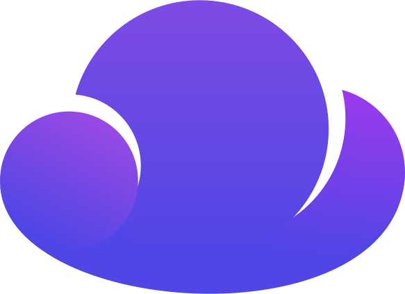

<div align="center">



# PageWeave CMS

*A self-hostable, single-file PHP CMS that lets your AI agent<br>build and edit your website over MCP. Drop one `index.php`<br>on a server, set an API key, done.*

<br>

**PageWeave just launched. The first 100 customers lock in<br>&euro;19/month per website — forever.**<br>
*That price applies to every Pro website on your account,<br>past and future, even after the offer ends.*<br>
[**Lock in early adopter pricing &rarr;**](https://pageweave.dev/create-account)

<br>

</div>

---

## The idea

We build [PageWeave](https://pageweave.dev/) — a fully managed platform where AI agents create and run production websites. We depend on free and open source software every day. PageWeave CMS is us giving something back.

The CMS distills PageWeave's core idea into a single PHP file: **an MCP server embedded in your website**. Your coding agent reads, creates, and edits pages, the header, the footer, and the `<head>` — all through a `/mcp` endpoint. No database. No dependencies. No build step. Just PHP.

Free. Open source. Forever.

## Why PHP?

PHP runs on virtually every web host on the planet — shared hosting, VPS, dedicated, behind Cloudflare, behind nginx, behind Apache. No runtime, no daemon, no container. Drop a `.php` file in a directory and it works.

That's the point. We wanted PageWeave CMS to be **easier to deploy than WordPress**. WordPress needs a database, an install wizard, and a filesystem that survives updates. PageWeave CMS is one file. Upload it, visit the domain, and you're running — database and all plumbing handled behind the scenes with flat files under `_cms/`.

No Composer. No npm. No Docker. No build step required to use it. Just PHP 8.3 or later and the extensions every host already ships.

---

## What makes it different

- **One file.** Upload `index.php` and you're running.
- **No database.** Content lives as flat HTML files under a `_cms/` directory.
- **Zero-config install.** First visit detects your web server, writes the routing rules, scaffolds everything, and generates an API key.

## Quick start

### 1. Get the file

Download the latest `index.php` from [Releases](../../releases) — or run `php build.php` to compile it yourself.

### 2. Upload it

Drop it into your web server's document root **as `index.php`**.

### 3. Visit your domain

That's it. The first visit auto-detects your server (Apache, LiteSpeed, or nginx), writes the routing config, creates `_cms/` with default pages and partials, generates a random MCP key, and shows an "Installation successful" page with your MCP endpoint and agent setup instructions.

Your site serves pages immediately. MCP is ready the moment setup finishes.

```text
https://your-host/mcp
```

Open `_cms/config.env` to see your generated key.

### 4. Connect your agent

Add the CMS as a remote MCP server. The install page generates a ready-to-paste config snippet with your host name — but here's the shape:

```jsonc
{
  "$schema": "https://opencode.ai/config.json",
  "mcp": {
    "acme-corp-com-pageweave-cms": {
      "type": "remote",
      "url": "https://acme-corp.com/mcp",
      "headers": {
        "Authorization": "Bearer YOUR_MCP_KEY"
      }
    }
  }
}
```

Restart your client so it picks up the new server, then prompt: *"Let's create a homepage for my website acme-corp.com using PageWeave CMS."*

### Updating

Replace `index.php` with the new version. Your `_cms/` data and `_cms/config.env` are preserved — nothing to reconfigure.

### Web server notes

- **Apache / LiteSpeed** — `.htaccess` written automatically (needs `AllowOverride FileInfo`).
- **nginx** — a `nginx.conf` snippet is generated next to `index.php`; copy it into your server block and reload.
- **Any server, no rewriting** — the MCP endpoint also works via PATH_INFO: `https://your-host/index.php/mcp`.

---

## PageWeave CMS vs PageWeave Cloud

PageWeave CMS gives you powerful MCP content management you run yourself. [PageWeave Cloud](https://pageweave.dev/) takes the same idea and adds a fully managed production suite — so you focus on building, not operating.

| | PageWeave CMS | PageWeave Cloud |
|---|---|---|
| **MCP content management** | Pages, header, footer, `<head>`, assets | Pages, header, footer, `<head>`, assets |
| **Versioning & rollback** | — | Every edit is a version. Revert or pin any time. Your live site stays untouched while you work. |
| **Confirmation workflows** | Changes apply immediately — set up your harness permissions accordingly. | Destructive or irreversible actions require explicit user approval first. |
| **Forms** | — | Built-in form builder. Spam protection, email notifications, webhooks. |
| **Data tables** | — | Structured content with Liquid templating, template pages (`:slug`), and a public JSON API. |
| **Themes** | — | daisyUI 5 + Tailwind v4. 35+ built-in themes, custom CSS. |
| **Analytics** | — | Privacy-first server-side analytics. No cookies. No trackers. |
| **Asset uploads** | Static files (drop in `assets/`) | Upload by URL or PUT. Auto WebP/AVIF conversion, responsive `srcset`, CLS prevention. |
| **Fonts** | — | Any font, proxied through PageWeave — no Google tracking. |
| **Domains** | Your own server | Custom domains, auto SSL. Purchase domains directly. |
| **Multi-site** | Single website | Unlimited websites. |
| **Team access** | — | Invite admins, editors, viewers. |
| **Deployment** | Drop one PHP file on your server | Nothing to deploy. Fully managed. |
| **Hosting** | Self-hosted | German servers. GDPR compliant. European company. |

**Ready for the full suite?** [Try PageWeave Cloud — free to start, no credit card →](https://pageweave.dev/create-account)

---

## Recommended coding agent

We recommend **[OpenCode Desktop](https://opencode.ai)** as your agent harness with **[OpenCode Go](https://opencode.ai/go?ref=511XQWT93A)** *(affiliate link)* coding plan. OpenCode is purpose-built for agent-driven software work and connects to PageWeave CMS in one config block.

---

## Agent tools

All tools follow the MCP JSON-RPC 2.0 spec. Your agent inspects available tools via `tools/list`.

| Tool | What it does |
|---|---|
| `ping` | Check the MCP server is alive. |
| `list_pages` | List all pages with paths and titles. |
| `get_page` | Get a page's HTML body, title, and description. |
| `create_page` | Create a new page at a given path. |
| `update_page` | Overwrite a page's body or apply find-and-replace patches. |
| `delete_page` | Delete a page and its file. |
| `get_component` | Get the current header or footer HTML. |
| `update_component` | Replace the header or footer HTML. |
| `get_html_head` | Get the global `<head>` partial (meta tags, styles, favicons). |
| `update_html_head` | Replace the global `<head>` partial. |
| `list_assets` | List files in the public `assets/` directory. |

---

## Configuration

All settings live in **`_cms/config.env`** — a `KEY=VALUE` file auto-created on first run with a generated MCP key. `index.php` is pure code; to change settings, edit `_cms/config.env`.

| Key | Purpose | Default |
|---|---|---|
| `MCP_KEY` | Bearer token for `/mcp`. Empty disables MCP (site still serves). | auto-generated (64 hex chars) |
| `SITE_URL` | Canonical base URL. Used instead of the `Host` header on the install page. | `''` |
| `SOURCE_URL` | Where your source code lives (AGPL §13). | upstream repo URL |
| `SITE_TITLE` | Fallback `<title>` when a page has none. | `My Site` |

`_cms/` is protected from direct web access by generated `.htaccess`/nginx rules — `_cms/config.env` (which holds your MCP key) is never served over HTTP.

---

## How content works

```
_cms/
├── config.env                            # your settings
├── partials/{head,header,footer}.html   # composed around every page
└── pages/<slug>.html                     # page body + optional frontmatter
assets/                                   # public static files
```

Pages are **body HTML** with an optional HTML-comment frontmatter:

```html
<!--
title: About Us
description: A short page about the team
-->
<h1>About</h1>
```

At request time the CMS composes the full document:

```
<head> partial  +  <title>  +  header partial  +  page body  +  footer partial
```

Edit a partial once — every page updates instantly.

---

## Development

The CMS is developed as modular source under `src/` and compiled by `build.php` into `dist/index.php`.

```bash
mise install                    # install PHP 8.3
composer install                # dev tooling (phpunit, cs-fixer, psalm)
vendor/bin/phpunit              # run tests
php build.php                   # build dist/index.php
php -l dist/index.php           # syntax-check the build
php -S localhost:8000 -t dist   # local smoke test
```

TDD is the working rhythm. No runtime Composer dependencies — only PHP 8.3 with `json`, `mbstring`, and `pcre`.

---

## Security

Found a vulnerability? Report it privately to **security@pageweave.dev** or via [GitHub Security Advisories](https://github.com/PageWeave/cms/security/advisories/new). Do not open a public issue.

See [SECURITY.md](./SECURITY.md) for the full policy, threat model, and audit history.

---

## License

Copyright &copy; 2026 PageWeave CMS contributors.

Licensed under the [GNU Affero General Public License v3.0 or later](./LICENSE) (AGPL-3.0-or-later). Running a **modified** version on a publicly reachable server requires you to offer the Corresponding Source to its users (AGPL §13). Running it **unmodified** only requires pointing to the upstream `SOURCE_URL`.
